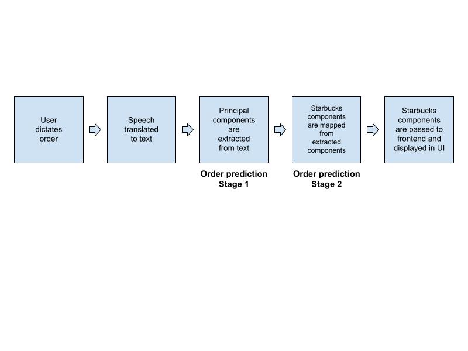
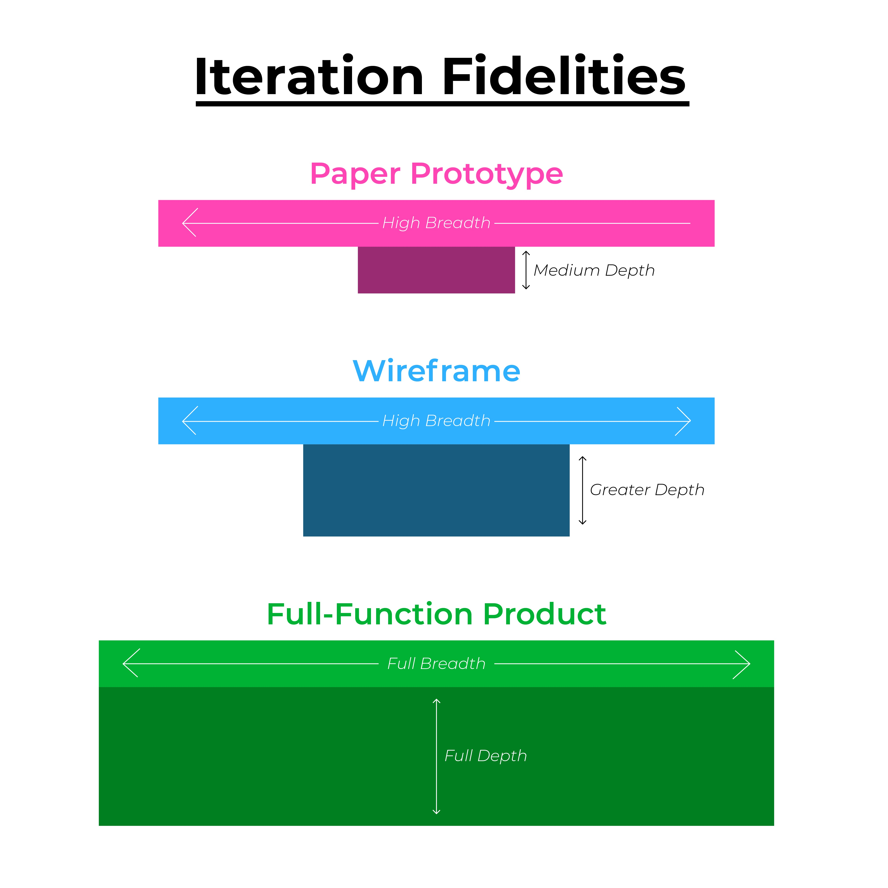
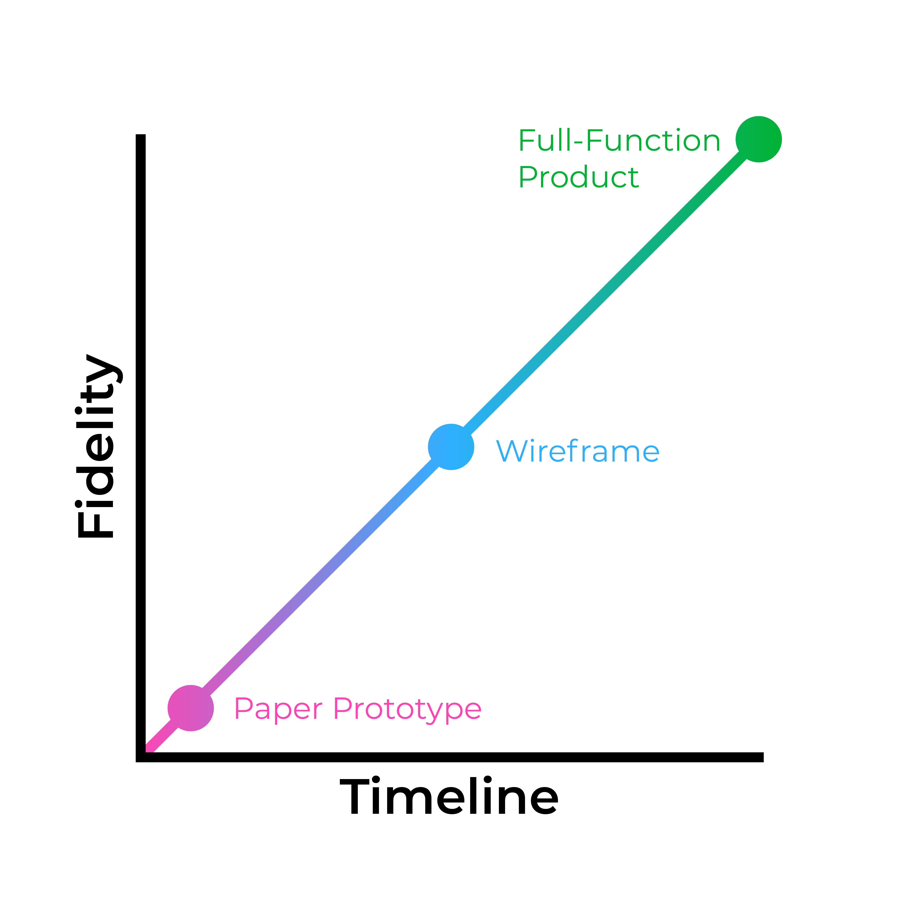

# CSC 212 | Human Computer Interaction Project Proposal

*Team Coffee Language Processor* | Bruinsma, Chi, Feliciano, Li, Paden

## Who we are

Iris
  
  -  Front End Coder
  - Major/Minor: CS, Legal Studies
  - Skills: Product Management, Editing, Figma
  - Fun Fact: I throw a stick for fun (javelin)  
- Dustin
  
  - UI/UX Designer
  - Majors: Digital Media Studies, Studio Arts, Psychology; UX Certificate
  - Skills: UI/UX Research and Design, Figma
  - Fun Fact: I’m a triplet
  
Jeffrey

  - Front End Coder
  - Major/Minor: Computer Science, Business
  - Skills: UI/UX, Product Presentation
  - Fun Fact: I enjoy photography 

Jack
  
  - Back End Coder
  - Major/minor: Computer Science, Statistics
  - Skills: Data Mining and Machine Learning
  - Fun Fact: Experiences Blidness
  
Chris

  - Back End Coder
  - Major/Minor: Computer Science
  - Skills: Machine Learning, Scrum Master, Git
  - Fun Fact: I was a Starbucks Coffee Master

## Problem Statement

There is no denying that there is an all important human aspect to the process of ordering coffee. Whether it is the person who rings up your order at the register or the one who calls your name with the drink. That being said, there are areas where human interaction is not needed and a computer would be better suited to do the job. 

Starbucks Coffee represents a second wave of coffee here in America. The first wave was provided by companies like Folgers giving the United States instant coffee and the like. Then Coffee was about convenience. Starbucks was the first to bring high quality Italian coffee to the United States and to present that style of ordering. What Starbucks also brought in were unseen amounts of customization to their drinks which is part of their fame. Indeed Starbucks boasts 87,000 permutations of their drinks. Another part of the Starbucks fame has been the inability for Starbucks Employees to properly write the names of customers on the cups.  Herein lies the problem. Evidenced by our experience at the University of Rochester as both students ordering drinks as baristas making the drinks we see that there is an overall need to improve the ordering process. 

We have divided the improvements into a few categories. The first is to make coffee more accessible. There is a language to order Starbucks drinks all on its own including important syntax and semantics. The phrase “Grande Hot Mocha” is a well formed drink but so is “Grande Brown-Sugar-Oat milk-Shaken Espresso.” In addition to the details required to order a drink which can be confusing enough, there can also be language barriers introduced that complicate the process which can make it more difficult for the baristas to understand what is being said and more difficult for the person ordering to get what they want.  By using an ordering system that makes use of such a system it also accelerates the pace of ordering by removing the overhead needed to train baristas on all of the many codes that need to be understood to make the drinks. A machine would be able to type : Latte with soy milk and two pumps of vanilla faster than a person could write: L + S + 2V in sharpie and ring the drink up on the register.  
Our goal is to make this easier by providing a natural language processing system that will use existing ordering methods: such as a drive-through. This stands as a way to simplify the ordering process and enable employees to be allocated to other areas such as the more important making of the drinks themselves.


## Need Finding 

Need-finding techniques will begin with mind-mapping or process-mapping; as this is a productive way to get our group’s thoughts in a cohesive, structured order. Mind-mapping has allowed us to understand we must do a task-analysis on the procedure of ordering coffee, observing user interactions. We plan to interview fanatics (daily consumers), servers, baristas, and others to understand the user task analysis. Using other techniques such as contextual inquiry, observations, and designed surveys, we will be able to find more information to better understand our demographic. 
 
We have specifically chosen to interview Starbucks employees and managers to understand a step-by-step of the ordering process, giving us more perspective. As this is going on, we will have distributed surveys to better understand feedback for the ordering process targeted towards students, faculty, community. We will also be asking specific questions such as the order of elements to aid in developing a user-friendly interface. These need-finding techniques will be outsourced publicly to the University of Rochester community, but mainly targeted towards those who spend time at Starbucks and who currently understand the frustrating order process. Additionally, we will be observing students and customers at Starbucks while watching staff interaction throughout rush hour and popular times. All surveys, interviews, and information gathered will be done so consensually. 


## Implementation

For this project, our aim is to translate real-world user-dictated Starbucks orders into a normalized form that can be passed to order placement services such as Grubhub. Below is a high level overview of our system. This section will explain our plans for implementation for each step. 



As we intend for this application to be cross platform compatible, we plan on using a Flutter frontend and a Firebase backend. This will ensure that our developer team does not need to code on two separate frameworks for future iOS and Android deployment. As we anticipate orders to be generally placed on mobile devices vs desktop devices, we will be making a mobile app and not a desktop application. As speech ordering could be less convenient on desktops than mobile devices, we do not anticipate this to be an issue.


The first step for a user to interact with our model is dictating their Starbucks coffee order. Flutter has a speech to text library, speech_to_text, which we plan on utilizing for this task. When speech is translated to text, we will send it to our backend where we will apply NLP techniques in a 2-stage process in order to translate a user-dictated order into a normalized form.

Stage 1 will be a Named Entity Recognition (NER) problem where principal component entities such as flavor, drink type, and size are extracted from user-dictated orders using the NLP library spaCy. NER in the context of our application can be visualized below

*I would like a <span style="color:red">large</span> <span style="color:green">black coffee</span> with two pumps of <span style="color:blue">vanilla</span>*

where:

<span style="color:red">red</span>:  size

<span style="color:green">green</span>: drink type

<span style="color:blue">blue</span>: flavor 

In order to train a model that can accurately do this task, we will need to annotate an abundance of real world data, namely user-dictated orders. We plan on sourcing the orders from surveys (process described in Needfinding section). This could pose a problem, as the overall accuracy of our model is contingent on the quality and magnitude of our dataset, which can vary based on how many people fill out our survey. Regardless of how much training data we receive, however, we hope to build a pipeline for a model that can be constantly improved and retrained as more training data comes in. Upon sourcing training data, we will manually annotate a certain amount of orders (depending on magnitude of training set) using the online tool **labelstud.io**. This tool allows for quick annotation of data for Named Entity Recognition model training by providing a GUI that allows users to use their computer pointer to highlight and tag individual entities. The software outputs the training set in the JSON format required by NER models for custom training. Assuming a large enough sample set and some typical lexical structure that user-dictated orders follow, this process will allow us to train an accurate NER model that recognizes entities in a user-dictated phrase.

After extracting entities from a given user-dictated order, we will pass the predicted entities to Stage 2, which will translate the predicted entities to actual Starbucks entities. An example can be seen below:

```{extractedSize: “large”} => {starbucksSize: “venti”}```

For this, we plan on implementing record linkage, which can be achieved by using cosine similarity in order to return similar vectors to each other. Using cosine matching, each word existing in the database for a specific Starbucks entity (size, for example) would be vectorized using a formula to be determined based on accuracy evaluation (either TF-IDF or Word2Vec) and the entity with the most similar vectorized form (using the cosine distance formula) to the entity extracted from Stage 1 would be returned. An illustration is shown below. 

Table of *Actual* Starbucks Sizes


## Table Styling in Markdown

<style>
    .heatMap {
        width: 70%;
        text-align: center;
    }
    .heatMap th {
        background: white;
        word-wrap: break-word;
        text-align: center;
    }
    .heatMap tr:nth-child(1) { background: gold; }
</style>

<div class="heatMap">

| Size |  Cosine Similarity with Extracted size "large" |
-------|------------------------------------------------|
Venti  | 0.7801                                         |
Grande | 0.4032                                         |
Tall   | 0.5209                                         |
Trenta | 0.6989                                         |

</div>


*As the vectorized form of “venti” is closest to that of “large”, venti would be the final size returned for our model.*

This process will be repeated for each of the principal components of a drink and stored in a JSON structure, which will be passed back to the frontend where the complete normalized order will be displayed.


## Timeline and deliverable


Since we are doing this in an Agile manner the who team owns every deliverable regardless. 

| Start Date | End Date| Deliverables | Assignee |
|------------|---------|--------------|----------|
| 10/23      | 10/29   | 1 Low fidelity wireframe and paper prototype <br><br> Finalize and release need-finding survey <br><br> Starbucks drinker user and barista research, conclusion on principal components of drinks | Dustin,Iris <br><br> Jack,Jeffrey,Chris <br><br> Chris, Jack, Iris | 
| 10/30 | 11/5 | Finish front-end-display(no backend communication required) <br><br> Summary Report on Need finding <br><br> Collect Training Data (real world order) | Jeffery, Dustin <br><br> Iris <br><br> Chris, Jack |
| 11/13 | 11/19 | Train Model <br><br> Create Website | Jack, Chris <br><br> Dustin, Iris, Jeffrey |
| 11/20 | 11/26 | Connect Model to front end <br><br> Finish Poster |  Jack, Chris <br><br> Dustin, Iris, Jeffrey|
| 11/27 | 11/29 | Finish Documentation and practice fro final presentation | Chris, Dustin, Iris, Jack, Jeffrey |


## Prototyping 


<br>

Each iteration of the prototype will be tested by 10 participants. To ensure each sample is generalizable to the larger Starbucks-consumer population, users will be selected based on diverse representations of genders, accents, ages, and order preferences.

Longitudinal study (5 users):
These users will be testing each prototype iteration throughout the semester to identify improvement and obstacles in user experience over time.

Cross-sectional study (5 users):
These users will be randomly selected in Starbucks to offer unbiased insights on each prototype iteration’s experience.




<style>
    .heatMap {
        width: 100%;
        text-align: center;
    }
    .heatMap th {
        background: green;
        word-wrap: break-word;
        text-align: center;
    }
    .heatMap tr:nth-child(1) { background: white; }
</style>

<div class="heatMap">

| Iteration | Type | Testing Environment | Evaluation |
|-----------|------|---------------------|------------|
| 1         | Paper Prototype <br> - Low Fidelity <br> - high breadth <br>  - Medium Depth | - Requires 3 team members (computer, facilitator, and observer) to meet with each tester. <br> - Detailed notes measuring time and feedback will be documented | - Rate how experience compares to traditional ordering <br> - Explain what users liked and disliked <br> - What additional features would users like to see. |
| 2 | Interactive Wireframe <br> - Medium Fidelity <br> - High Breadth <br> - Greater depth | - Two team members (audio computer/facilitator, observer) meet with each user <br> - Test ordering via wizard-of-oz style audio interaction and Figma wireframe on iPad   | - Design aesthetics <br> - Interaction reaction time while performing tasks<br> - Task Flow <br> - Clarity and usability of features <br> - User Feedback |
| 3| Full-function Audio and Tactile Interface<br> - High Fidelity <br> - Full Breadth <br> - Full Depth  | - Observe what users interacting with fulling functional product in Starbucks | - Evaluating experiences',accessibility, functionality, efficiency, interaction, and satisfaction <br> - Follow-up feedback after completing experience and receiving their drink |
</div>

## Alternative Solution

1. Instead of addressing the problem between the baristas and the customers we could try to make it easier to make online orders. There is a huge issue with Grubhub orders getting backed up and it leaves the baristas to have to shut down online orders, if there was a better solution to get Grubhub orders from the phone to the table it would also solve the problem of communication errors, ie. Instead of printing an entire order on a small sheet of paper, the order should be split into each section so it is easier to complete the order instead of having one person having to split up the order manually.

2. Coffee is often lost in translation, having a way to unify the meaning of coffee would completely simplify the process for baristas. There are many ways to interpret what a regular coffee is or any generalization of terms, if there was a way to translate it into an universal meaning it would simplify the process of making coffee for people. ie. If someone orders a ‘regular coffee,’ does that mean milk and sugar or just black coffee, if there was a way to identify where someone was from and then translate it to what the customer deems as a ‘regular coffee’ there would be no reason for the barista to need to interpret what the customer means and both parties would be happy.

3. To cut out the middle man, there should be a way to instantly get your order sent to the espresso machine and have it make the coffee itself. This relieves a lot of stress on the baristas to keep up with the demand, each coffee making machine that chains use have source code that can be altered and changed. If it could connect to Grubhub through a third party and then make the coffee itself as long as the barista puts the cup where it’s supposed to be, this saves a little bit of time per order. Instead of having the barista push the buttons, it saves a couple seconds each time but a couple seconds each time adds up to a lot of time.


